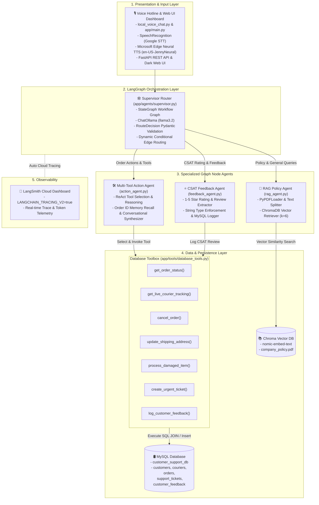
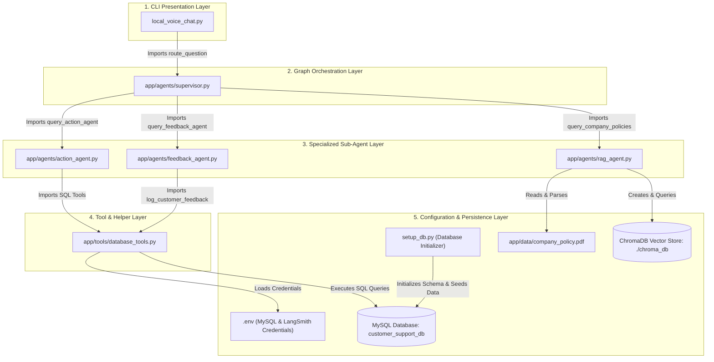
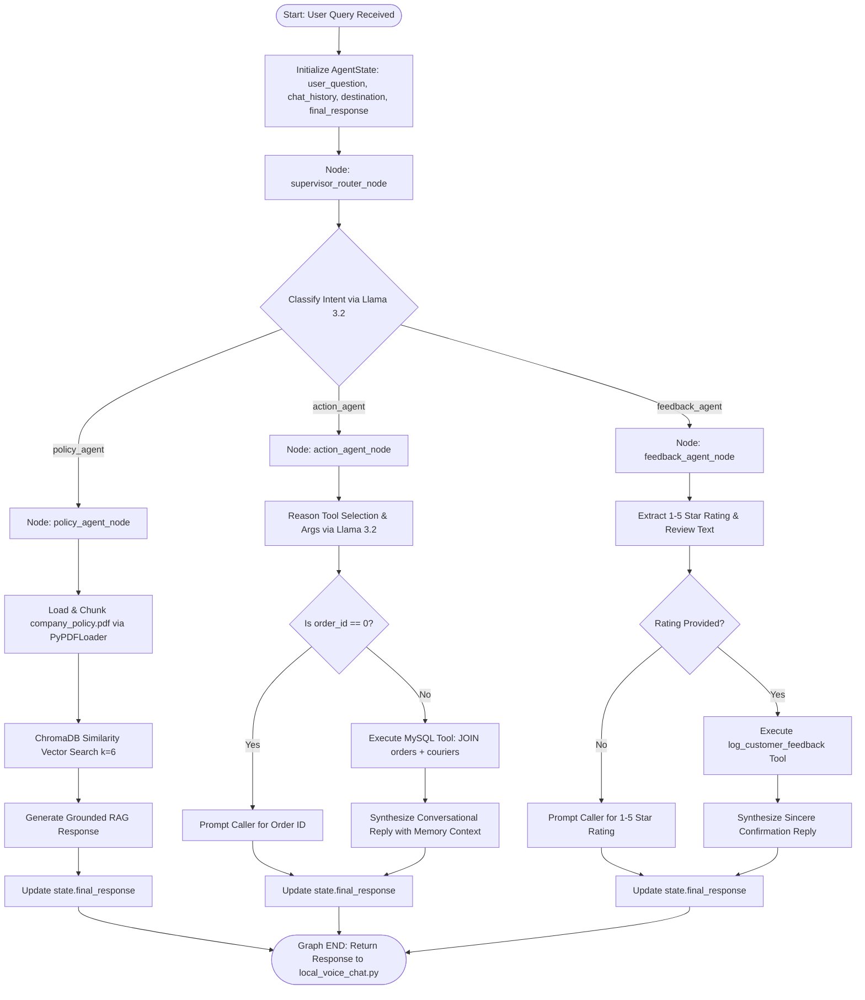
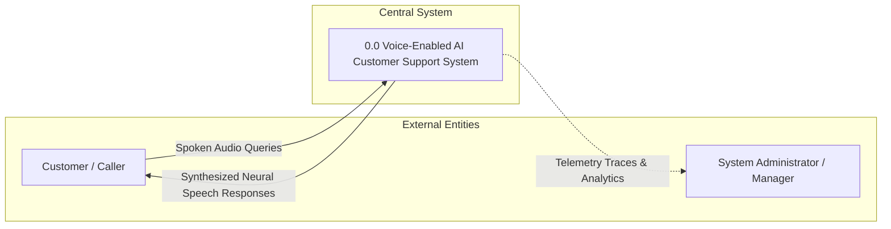
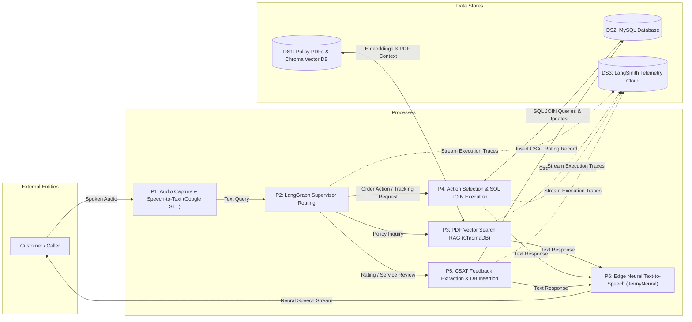
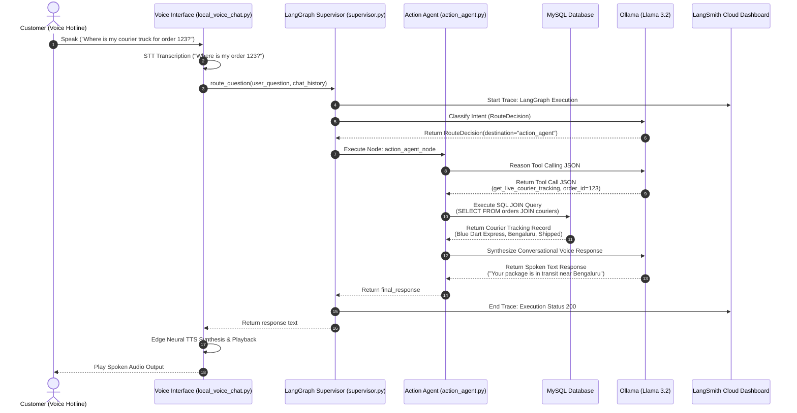

# Voice-Enabled Customer Support Agent - Architecture & System Specifications

This document provides comprehensive technical specifications for the **Voice-Enabled AI Customer Support Hotline Capstone Project**. It covers the **LangGraph StateGraph Workflow**, **Relational Database Schema**, **Multi-Page PDF Vector RAG**, **Clean Sequential Voice Pipeline**, and **LangSmith Cloud Observability**.


---

## 1. System Architecture Diagram

The system follows a **LangGraph StateGraph Orchestration Architecture** that routes user requests across specialized sub-agent graph nodes running 100% locally with **Ollama**, **ChromaDB**, and **MySQL**, with telemetry streamed to **LangSmith**.



---

### 1.1 File Module Dependency Graph

This diagram illustrates the explicit Python import dependencies and file relationships across all layers of the codebase.



---

## 2. LangGraph State Machine Workflow Diagram



---

## 3. Data Flow Diagrams (DFD)

### 3.1 DFD Level 0 (System Context Diagram)
A high-level view representing the entire AI Voice Hotline as a single central system interacting with external entities.



---

### 3.2 DFD Level 1 (Detailed Functional Process Decomposition)
Detailed breakdown of system processes (P1-P6), data stores (DS1-DS3), and data flows.



---

## 4. System Sequence Diagram (Voice & Tool Execution)




---

## 5. MySQL Relational Schema


```sql
-- 1. Customers Table
CREATE TABLE customers (
    customer_id INT AUTO_INCREMENT PRIMARY KEY,
    name VARCHAR(100) NOT NULL,
    email VARCHAR(100) UNIQUE NOT NULL,
    phone VARCHAR(20) NOT NULL,
    shipping_address VARCHAR(255) NOT NULL
);

-- 2. Couriers Table
CREATE TABLE couriers (
    courier_id INT AUTO_INCREMENT PRIMARY KEY,
    courier_name VARCHAR(50) NOT NULL,
    contact_number VARCHAR(20) NOT NULL
);

-- 3. Orders Table (FK referencing customers & couriers)
CREATE TABLE orders (
    order_id INT PRIMARY KEY,
    customer_id INT NOT NULL,
    courier_id INT NOT NULL,
    status VARCHAR(50) NOT NULL,
    estimated_delivery VARCHAR(50) NOT NULL,
    tracking_number VARCHAR(100) UNIQUE NOT NULL,
    current_location VARCHAR(255) NOT NULL,
    FOREIGN KEY (customer_id) REFERENCES customers(customer_id) ON DELETE CASCADE,
    FOREIGN KEY (courier_id) REFERENCES couriers(courier_id) ON DELETE CASCADE
);

-- 4. Support Tickets Table (Manager Escalations)
CREATE TABLE support_tickets (
    ticket_id INT AUTO_INCREMENT PRIMARY KEY,
    order_id INT NOT NULL,
    customer_issue TEXT NOT NULL,
    priority VARCHAR(20) DEFAULT 'URGENT',
    status VARCHAR(20) DEFAULT 'OPEN',
    created_at TIMESTAMP DEFAULT CURRENT_TIMESTAMP,
    FOREIGN KEY (order_id) REFERENCES orders(order_id) ON DELETE CASCADE
);

-- 5. Customer Feedback Table (CSAT Ratings)
CREATE TABLE customer_feedback (

    feedback_id INT AUTO_INCREMENT PRIMARY KEY,
    order_id INT NULL,
    rating INT NOT NULL,
    feedback_text TEXT,
    created_at TIMESTAMP DEFAULT CURRENT_TIMESTAMP,
    FOREIGN KEY (order_id) REFERENCES orders(order_id) ON DELETE SET NULL
);
```
