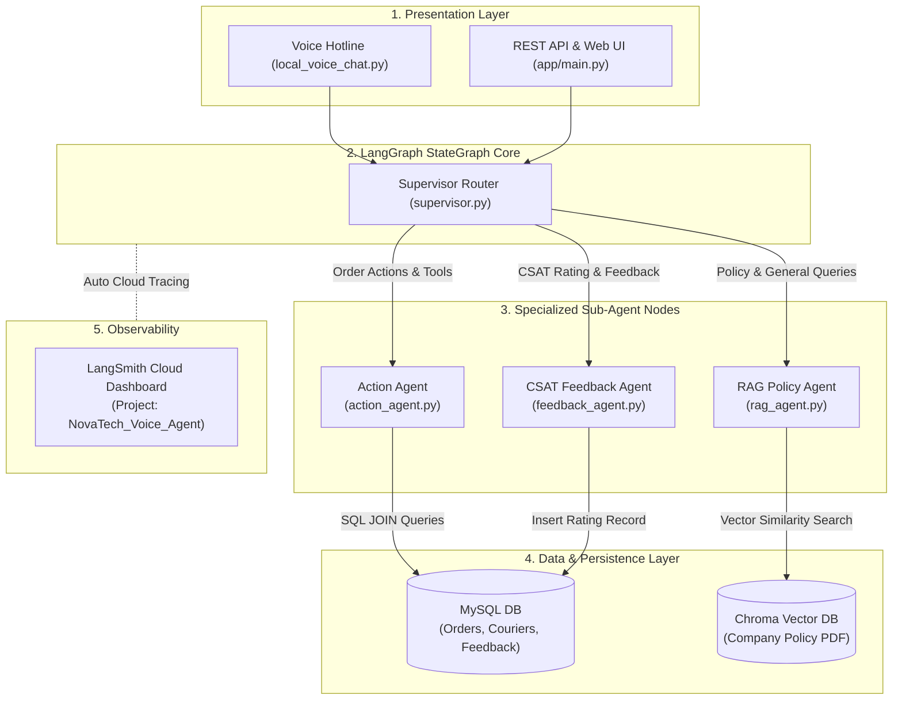

# Voice-Enabled AI Customer Support Agent


A stateful, multi-agent AI voice hotline built using **LangGraph**, **LangChain**, **LangSmith**, **Ollama**, **ChromaDB**, **MySQL**, and **FastAPI**.


<p align="center">

  
  
  
  
  
  
  
  
  
  
  
  
</p>

---

## Problem Statement

Traditional customer support operations face critical operational bottlenecks:
- **High Hold Times:** Callers wait 20+ minutes during peak sales periods for basic order status inquiries.
- **Coverage Gaps:** Maintaining 24/7 human support teams across night shifts is cost-prohibitive for growing businesses.
- **Agent Burnout:** Up to 70% of call volume is spent answering repetitive Tier-1 queries (e.g., package tracking, return policy checks).

**The Solution:** NovaTech AI Voice Hotline is a stateful, multi-agent conversational system that automates Tier-1 support queries over spoken microphone audio and web REST APIs in real time, eliminating wait times and providing 24/7 availability.

---


## Architectural Highlights

- **LangGraph StateGraph Workflow Orchestration:** Built with explicit state machine nodes (`action_agent`, `policy_agent`, `feedback_agent`), dynamic conditional edge routing, and central session state management.
- **LangSmith Cloud Observability:** Real-time end-to-end telemetry tracing for LLM prompts, token consumption, Pydantic schema validation, SQL tool payloads, ChromaDB retrievals, and latency profiling.
- **Microsoft Edge Neural TTS and Speech-to-Text:** Natural voice synthesis (`en-US-JennyNeural`) paired with microphone audio capture via Google STT, featuring clean sequential turn-taking stream management.
- **Multi-Page PDF Policy RAG:** Ingests, chunks, embeds (`nomic-embed-text`), and vector-searches policy handbooks (`company_policy.pdf`) via `PyPDFLoader` and ChromaDB.
- **Relational MySQL Database:** Relational MySQL schema (`customers`, `couriers`, `orders`, `support_tickets`, `customer_feedback`) supporting multi-table SQL `JOIN` tool execution.

- **CSAT Feedback & Order Tracking:** Dedicated feedback agent extracting 1-5 star CSAT ratings, customer comments, and live courier tracking details.

---

## System Architecture



---

## Project Structure

```text
langgraph-agentic-voice-support/
├── app/
│   ├── agents/
│   │   ├── supervisor.py         # LangGraph StateGraph Workflow Orchestrator
│   │   ├── action_agent.py       # ReAct Multi-Tool Agent (Order status, tracking, cancellations)
│   │   ├── rag_agent.py          # PDF Policy Vector Search Agent (PyPDFLoader + ChromaDB)
│   │   └── feedback_agent.py     # CSAT 1-5 Star Rating & Review Processing Agent
│   ├── tools/
│   │   └── database_tools.py     # MySQL Relational Database Tools (@tool functions with SQL JOINs)
│   ├── data/
│   │   ├── company_policy.tex    # Source LaTeX policy document
│   │   └── company_policy.pdf    # Compiled multi-page PDF handbook
│   └── main.py                   # FastAPI Backend & Web UI Dashboard
├── Outputs/                      # Folder for UI Screenshots, Telemetry Logs & Demo Recordings
├── local_voice_chat.py           # Voice Hotline CLI Interface with Edge Neural TTS
├── setup_db.py                   # Database Schema Initialization and Data Seeding Script
├── Info.md                       # Comprehensive PRD, Sequence Diagrams, and Database Schemas
├── .env                          # Environment Configuration (MySQL & LangSmith Tracing Keys)
└── requirements.txt              # Pinned Project Dependencies

```


---

## Setup and Quickstart

### 1. Prerequisites
- **Python 3.10+**
- **MySQL Server** (Running locally on port 3306)
- **Ollama** installed from [ollama.com](https://ollama.com)

Pull the required Ollama models:
```bash
ollama run llama3.2
ollama pull nomic-embed-text
```

### 2. Virtual Environment Setup
```bash
python -m venv venv
venv\Scripts\activate
pip install -r requirements.txt
```

### 3. Environment Configuration (`.env`)
Create a `.env` file in the project root:
```env
MYSQL_HOST=localhost
MYSQL_PORT=3306
MYSQL_USER=root
MYSQL_PASSWORD=your_password
MYSQL_DATABASE=customer_support_db

LANGCHAIN_TRACING_V2=true
LANGCHAIN_ENDPOINT=https://api.smith.langchain.com
LANGCHAIN_API_KEY=your_langsmith_api_key
LANGCHAIN_PROJECT=NovaTech_Voice_Agent
```

### 4. Database Initialization
Initialize the MySQL relational database schema:

```bash
python setup_db.py
```

---

## Running the Application

### Option A: Interactive AI Voice Hotline
Run the real-time voice hotline CLI interface:
```bash
python local_voice_chat.py
```

### Option B: FastAPI Backend & Web UI (Recommended)
Start the REST API and Web Dashboard server:
```bash
uvicorn app.main:app --reload
```
Access points:
- **Web UI Dashboard:** `http://localhost:8000/`
- **Interactive API Documentation:** `http://localhost:8000/docs`
- **Health Check Endpoint:** `http://localhost:8000/health`

### Option C: Docker Desktop Container
Build and run using Docker:
```bash
docker build -t voice-chat-app .
docker run -it --name voice_agent_container -e MYSQL_HOST=host.docker.internal -e OLLAMA_BASE_URL=http://host.docker.internal:11434 voice-chat-app
```

---

## Telemetry and Observability (LangSmith)

Open **[smith.langchain.com](https://smith.langchain.com)** to inspect real-time execution telemetry for every call session:
- Monitor LangGraph node transitions (`supervisor` -> `action_agent` -> `END`).
- Inspect SQL queries, tool invocation arguments, and Pydantic validation outputs.
- Track token usage and execution latency metrics.
